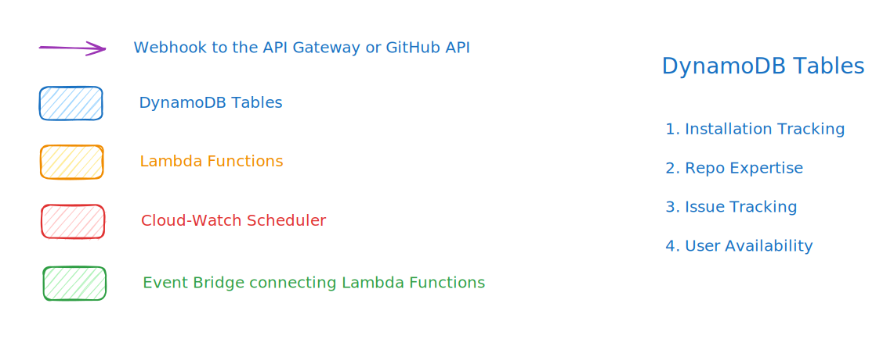
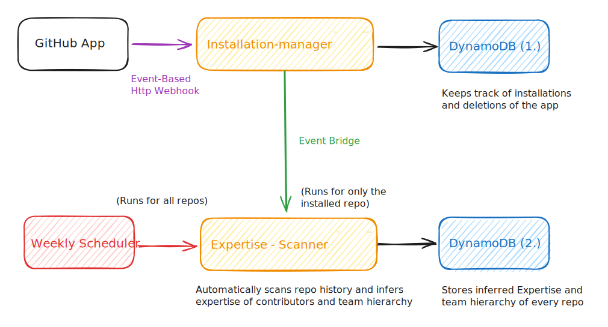
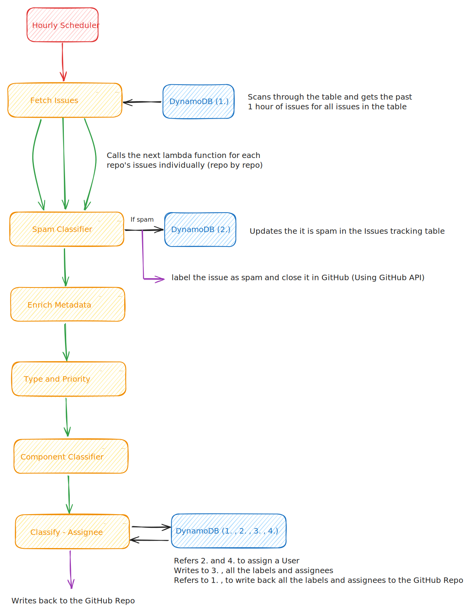
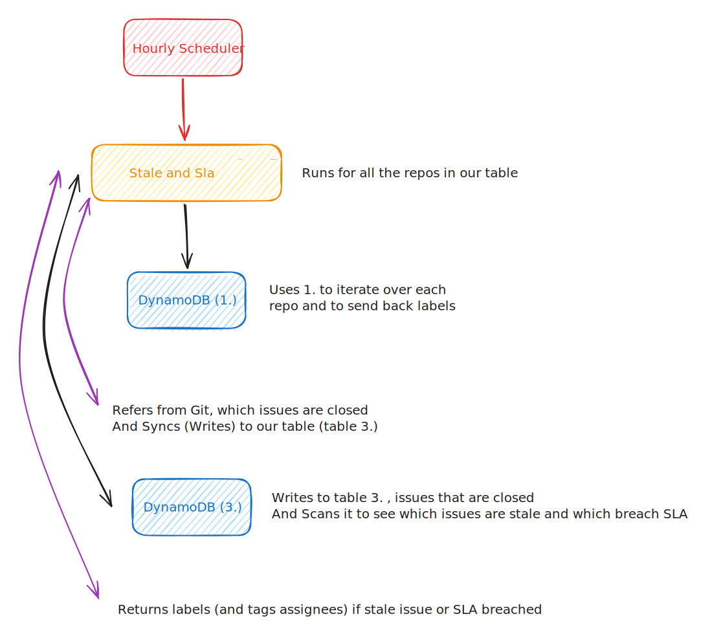
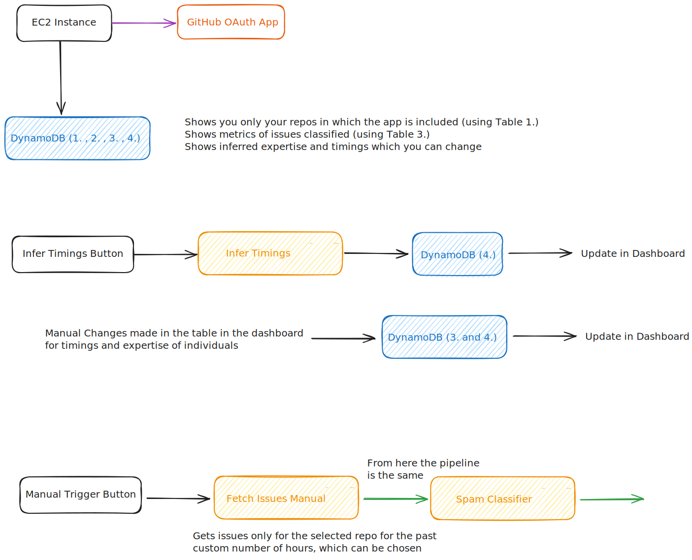
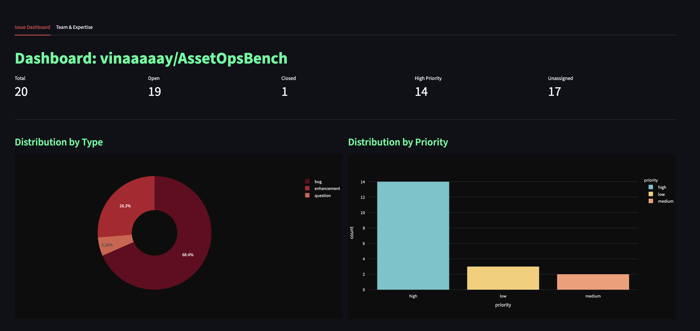
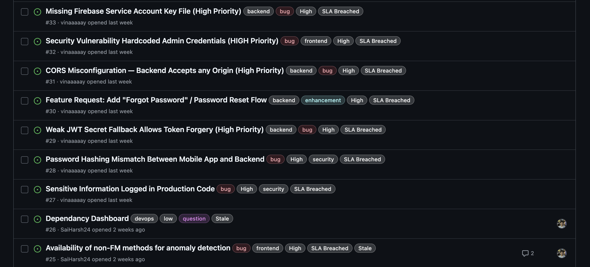

#  IssueOps: Intelligent Repository Management

> **Automate Triage. Optimize Routing. Empower Teams.**

**IssueOps** is a comprehensive GitHub App and Dashboard solution designed to streamline your development workflow. By leveraging Machine Learning and intelligent routing, it automates the tedious parts of issue management, allowing your team to focus on what matters: **writing code**.

---

##  Key Features

### Automated Triage & Classification
- **Smart Component Detection**: Uses LLMs to analyze issue content and classify it into one of 7 distinct components:
  - **Frontend** 
  - **Backend** 
  - **Database** 
  - **DevOps** 
  - **Mobile** 
  - **Documentation** 
  - **Security** 
- **Issue Type Classification**: Automatically categorizes issues into **Bug**, **Enhancement**, or **Question**.
- **Priority Assignment**: Analyzes urgency to assign priority levels (High, Medium, Low).

- **Spam Filtering**: Automatically flags and closes spam or low-quality issues.

### Intelligent Routing
- **Expertise Matching**: Routes issues to the best-suited maintainer based on their past contributions and skills.
- **Availability-Aware**: Checks team availability (working hours) before assigning tasks to prevent burnout.
- **Dynamic Learning**: Continuously updates contributor profiles based on their latest activity.

### Interactive Dashboard
- **Real-time Metrics**: View issue trends, closure rates, and backlog health.
- **Team Management**: Manage roles, skills, and working hours for all contributors.
- **Manual Triggers**: Manually trigger scans and pipeline runs for testing and immediate updates.

---

## Architecture & Tech Stack
This project is built on a modern, 100% serverless, event-driven architecture designed for scalability, security, and low operational overhead.

### **Core Architecture**
- Provider: Amazon Web Services (AWS)
- Pattern: Event-Driven / Asynchronous
- Identity: GitHub App (JWT-based authentication)

### **Tech Stack**
#### Compute & Logic
- AWS Lambda (Python 3.12): Handles all core logic, including issue fetching, classification, assignment, and SLA enforcement.

#### Orchestration & Events
- Amazon EventBridge: Manages the event bus that decouples the pipeline (e.g., issue.batch.new triggers classify_spam).
- Scheduled Rules: Triggers hourly ingestion jobs and daily SLA checks.

#### Data Storage
- Amazon DynamoDB: Serves as the single source of truth for:
- Issues: Tracking lifecycle, labels, and assignment (IssuesTrackingTable).
- Intelligence: Storing inferred expertise and team availability (RepoExpertise, UserAvailability).
- Installations: Managing active GitHub App installations (github-installations).

#### Intelligence & AI
- AWS Bedrock: Provides access to Foundational Models.
- Mistral 7B Instruct (v0:2):
  - Used for inferring developer expertise and team structures.
  - Used for inferring type, priority and component of an issue.
- Llama 3 8B Instruct: Used for spam filtering and metadata enrichment (rewriting titles/bodies).
- DeepSeek V3: Powering the "Master Agent" for final issue assignment decisions.

#### Security
- AWS Secrets Manager: Securely stores GitHub App private keys and OAuth client secrets.
- IAM Roles: Least-privilege roles assigned to each Lambda function and the EC2 instance.

#### Frontend / Control Plane
- Streamlit: A Python-based dashboard for monitoring, configuration, and manual triggers.
- Amazon EC2 (t3.small): Hosts the dashboard, secured with an IAM Instance Profile.
- GitHub OAuth: Authenticates admin users and authorizes access based on repository permissions.

---

## Under the Hood: Architecture & Pipelines
The system is composed of four distinct, event-driven pipelines that operate asynchronously to manage the issue lifecycle and gather intelligence.

### **1. Installation & Intelligence Pipeline**
This pipeline ensures the system is aware of new repositories and continuously learns about the development team.
- **Installation Tracker:** When the GitHub App is installed on a new repo, a webhook triggers the installation-manager Lambda. This function registers the repository in the DynamoDB table github-installations, marking it for future scans.
- **Expertise Scanner:** A weekly scheduled event triggers the expertise_scanner Lambda. It performs a deep scan of the last 30 days of commit history, merged PRs, and file changes. It uses Mistral 7B (Bedrock) to analyze this data, inferring developer technical skills and the repository's team structure (e.g., distinguishing "Frontend" from "Backend" teams). These profiles are saved to the RepoExpertise table.
- **Availability Inference:** A separate job, infer-availability, analyzes timestamp data from commits and comments over the last 90 days. It calculates the optimal 8-hour working window (UTC) for each contributor to ensure issues aren't assigned to sleeping developers. This data is stored in UserAvailability.

### **2. Issue Triage Pipeline (Hourly)**
This is the core "Hot Path" for real-time issue management, executing every hour.
- **Fetch:** The fetch_and_classify_issues Lambda wakes up hourly, pulling new issues from all registered repos via the GitHub API. It deduplicates against DynamoDB to ensure processing efficiency and pushes valid new issues to EventBridge.
- **Filter & Enrich:**
  - **Spam Check:** The classify_spam Lambda consumes the new issue event and uses Llama 3 8B to detect and flag spam immediately.
  - **Metadata:** The enrich_metadata Lambda then uses LLMs to rewrite vague titles and bodies for clarity, ensuring downstream models have high-quality input.
- **Classification:** A single, unified Lambda function uses Mistral 7B (Bedrock) to analyze the enriched content and predict both the Issue Type (Bug/Feature) and Priority (High/Low) in one pass, replacing the previous multi-step BERT pipeline.
- **Component Detection:** A subsequent Lambda function analyzes the issue to identify the specific Component (e.g., Frontend, Backend, Infrastructure) affected, enabling more granular assignment logic.
- **Assignment:** The classify_assignee Lambda acts as the "Master Agent." It reads the issue context, developer skills (RepoExpertise), availability (UserAvailability), and current workload (IssuesTrackingTable) from DynamoDB. It selects the best assignee using DeepSeek V3 and updates the issue on GitHub via API.

### **3. SLA & Stale Handler (Maintenance)**
A dedicated "Housekeeper" pipeline runs every hour to maintain hygiene and accountability.
- **Sync:** Checks open issues against GitHub to see if they were closed externally (e.g., by a user), syncing the status to DynamoDB.
- **Stale Enforcement:** Automatically tags issues with no activity for 7 days as Stale.
- **SLA Monitoring:** Monitors High-Priority issues. If an issue remains open past the threshold (e.g., 54 hours for High), it proactively pings the assignee with a comment and applies an SLA Breached label.

### **4. Control Plane (Dashboard)**
A centralized interface for administration and visibility.
- **Interface:** A Streamlit dashboard hosted on an AWS EC2 (t3.small) instance.
- **Security:** Secured via GitHub OAuth, ensuring users can only manage repositories they have write-access to.
- **Capabilities:**
  - **Visualization:** View distribution metrics for issue types and priorities.
  - **Management:** Manually edit AI-inferred expertise and working hours.
  - **Manual Triggers:** Immediately trigger the classification pipeline for a specific repository on-demand.
---
## Architecture Diagrams

---

---

---

---

---
## Getting Started

### 1. Install the GitHub App
1.  Navigate to the **[App Installation Page](https://github.com/apps/ds252-issueops)**.
2.  Click **Install** and select the repositories you want to manage.
3.  *That's it!* The app will start scanning for new issues every hour.

### 2. Access the Dashboard
The dashboard provides deep insights and control over the automation.

- **URL**: `http://65.0.75.51:8501/` 
- **Features**:
    - Visualize issue distribution.
    - Update team expertise profiles.
    - Dedicated button for manual issue scans.

---

## Screenshots

---

### Automated Labeling in Action
The bot automatically analyzes and labels issues directly on GitHub.

---

## Project Contributions

**Sai Harsh (saiharsh@iisc.ac.in):**
- **Infrastructure & Deployment:** Architected and deployed the entire Serverless AWS infrastructure, including 10+ Lambda functions, EventBridge rules, and DynamoDB tables.
- **Intelligence Engine:** Built the Expertise Scanner (Mistral 7B) to infer developer skills from commit history and the Availability Inference engine to calculate working hours from activity timestamps.
- **Control Plane (Dashboard):** Developed the full Streamlit Dashboard, implementing GitHub OAuth security, the "Manual Trigger" system, and the Team Management interface.
- **Maintenance Automation:** Created the SLA & Stale Issue Handler to automatically police repository hygiene (auto-closing stale issues, pinging on SLA breaches).
- **Assignment Execution:** Wrote the "Master Agent" logic that synthesizes data from all pipelines to make the final API calls to GitHub (Labeling & Assigning).
- **Installation Management:** Implemented the Installation Manager Lambda function to handle GitHub App installation and uninstallation webhooks.

**Vinay (vinay2023@iisc.ac.in):**
- **Spam Detection:** Implemented the Llama 3-based spam filtering system to sanitize incoming issues.
- **Metadata Enrichment:** Developed the prompt engineering and logic to rewrite vague issue titles/bodies for clarity and better accuracy of the next agents in the pipeline.
- **Classification Models:** Built and integrated the classification logic for:
  - **Issue Type** (Bug/Enhancement/Question)
  - **Priority** (High/Medium/Low)
  - **Component Detection** (Frontend/Backend/Infra etc)
- **Frontend Components:** Contributed to the design and layout components of the Streamlit user interface.

**Ashwin (ashwinkm@iisc.ac.in):**
- **Issue Intake:** Co-developed (Sai Harsh) the core logic for fetching and parsing raw issues from the GitHub API.
- **Assignment Algorithms:** Worked on the decision-making algorithms used to filter potential assignees based on workload.
- **Duplicate Detection (Prototype):** Developed logic to identify potential duplicate issues, but for specific repositories, hence not implemented.
- **SLA Logic Design:** Contributed to the design of the Service Level Agreement (SLA) logic and thresholds used for issue monitoring.

---

## Acknowledgements
This project was done as part of the **DS252 Introduction to Cloud Computing** (Aug, 2025) course. 

We acknowledge the use of AI coding assistants (GitHub Copilot, ChatGPT, Gemini) to accelerate development, debug infrastructure code, and generate boilerplate for standard AWS patterns.

---
